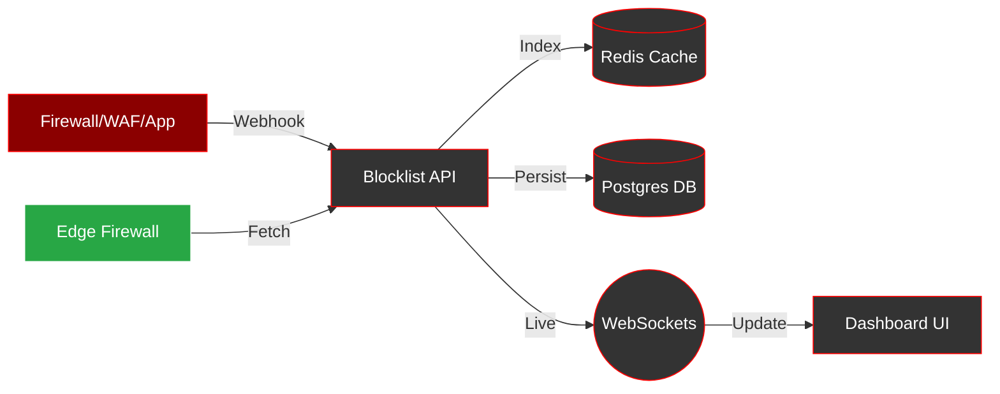

<p align="center">
  
</p>

<p align="center">
  <a href="#"></a>
  <a href="#"></a>
  <a href="#"></a>
  <a href="#"></a>
  <a href="#"></a>
</p>

# Blocklist App (Go Edition)

A high-performance, security-hardened IP management platform with GeoIP enrichment, real-time updates via WebSockets, and advanced filtering capabilities.

## 🔄 Project Flow



## Key Features

- **Advanced Filtering**: Server-side filtering by IP, Reason, Country, Added By, and Date Range (ISO8601).
- **Real-time Updates**: Live dashboard updates via WebSockets, now scaled with **Redis Pub/Sub** for multi-instance support.
- **Visual Threat Intelligence**: Dedicated **Thread Map** page with interactive mapping (Leaflet) and distribution charts (Chart.js) for instant situational awareness.
- **Local Map Solution**: Integrated world GeoJSON for offline mapping without external tile provider dependencies.
- **Reliable Webhooks**: Persistent **Task Queue** for outbound notifications with automatic retries and exponential backoff.
- **Bulk Operations**: Multi-select interface for batch unblocking and management.
- **Security Hardening**: Session invalidation on permission changes and mandatory 2FA setup.
- **Interactive API Docs**: Embedded **API Reference** via RapiDoc/Scalar at `/docs`.
- **GeoIP Enrichment**: Automated ASN, Country, and City detection for all entries.
- **Observability**: Prometheus metrics for latency and operations, protected by IP-based ACL.
- **Hardened Deployment**: Non-root Docker images based on Alpine 3.21 with conditional `:latest` tagging.

## Project Structure
- `cmd/server`: Go web server entry point, migrations, and static/template assets.
- `internal/api`: HTTP handlers, middlewares (Auth, RBAC, Metrics), and WebSocket hub.
- `internal/metrics`: Prometheus metrics definitions.
- `internal/repository`: Redis and PostgreSQL data access layers.
- `internal/service`: Core business logic (Auth, IP management, GeoIP, Webhooks).

## API Endpoints

### Automated Webhooks
- **`POST /api/v1/webhook`**: Authenticated webhook. Supports `ban`, `unban`, and `whitelist` actions.
    - **Example (Block)**: `curl -X POST -H "Authorization: Bearer YOUR_TOKEN" -H "Content-Type: application/json" -d '{"ip":"1.2.3.4","act":"ban","reason":"manual"}' http://localhost:5000/api/v1/webhook`
    - **Example (Whitelist)**: `curl -X POST -H "Authorization: Bearer YOUR_TOKEN" -H "Content-Type: application/json" -d '{"ip":"1.2.3.4","act":"whitelist","reason":"trusted"}' http://localhost:5000/api/v1/webhook`
    - *Note: If no IP is provided for the whitelist action, the caller's source IP is used.*

### Data & Stats
- **`GET /api/v1/ips`**: Paginated list of blocked IPs with advanced filters.
- **`GET /api/v1/ips_list`**: Simple JSON array of all blocked IP addresses.
- **`GET /api/v1/raw`**: Plain-text list of blocked IPs.
- **`GET /api/v1/ips/export`**: Export data in CSV or NDJSON format.
- **`GET /api/v1/stats`**: Aggregate statistics including top countries, ASNs, and reasons.

## RBAC Roles

| Role | Permissions |
| :--- | :--- |
| **Viewer** | View dashboard, search IPs, view stats, export data. |
| **Operator** | All Viewer permissions + Block/Unblock IPs, manage Whitelist. |
| **Admin** | All Operator permissions + Manage Admin accounts and API tokens. |

## Quick Start (Development)

1. **Configure Environment**: Set required variables in `.env`.
2. **Start Dependencies**: Ensure Redis and PostgreSQL are running.
3. **Run Migrations**: Handled automatically on server start.
4. **Build & Run**:
   ```bash
   go build -o blocklist-server ./cmd/server/main.go
   ./blocklist-server
   ```

## Docker Deployment
- **Build**: `docker build -t blocklist:go .`
- **Run**: `docker compose -f docker-compose.go.yml up -d`

## Granular Permissions

The platform uses a detailed permission system for administrators:
- **Monitoring**: `view_ips`, `view_stats`, `view_audit_logs`
- **Enforcement**: `block_ips`, `unblock_ips`, `manage_whitelist`, `whitelist_ips`
- **System**: `manage_webhooks`, `manage_api_tokens`, `manage_admins`
- **Utility**: `export_data`

## Configuration

The application is configured via environment variables:

| Variable | Description | Default |
|----------|-------------|---------|
| `SECRET_KEY` | Key for session signing and encryption | `change-me` |
| `PORT` | Listening port | `5000` |
| `REDIS_HOST` | Redis server hostname | `localhost` |
| `REDIS_PORT` | Redis server port | `6379` |
| `REDIS_PASSWORD` | Redis password | (empty) |
| `REDIS_DB` | Redis database for IP storage | `0` |
| `REDIS_LIM_DB` | Redis database for rate limiting | `1` |
| `POSTGRES_URL` | PostgreSQL connection string | `postgres://...` |
| `GUIAdmin` | Primary administrator username | `admin` |
| `GUIPassword` | Primary administrator password | `password` |
| `GUIToken` | Primary administrator 2FA seed (optional) | (empty) |
| `DISABLE_GUIADMIN_LOGIN` | Disable login for the default admin user | `false` |
| `LOGWEB` | Enable verbose web logging (debug level) | `false` |
| `BLOCKED_RANGES` | Comma-separated list of subnets to whitelist | (empty) |
| `GEOIPUPDATE_ACCOUNT_ID` | MaxMind Account ID | (empty) |
| `GEOIPUPDATE_LICENSE_KEY` | MaxMind License Key | (empty) |
| `TRUSTED_PROXIES` | Comma-separated list of trusted proxy IPs | `127.0.0.1` |
| `USE_CLOUDFLARE` | Enable Cloudflare specific header handling | `false` |
| `ENABLE_OUTBOUND_WEBHOOKS` | Master switch for outbound notifications | `false` |
| `RATE_LIMIT` | Global API rate limit (requests) | `500` |
| `RATE_PERIOD` | Rate limit window (seconds) | `30` |
| `RATE_LIMIT_LOGIN` | Rate limit for login attempts | `10` |
| `RATE_LIMIT_WEBHOOK` | Rate limit for incoming webhooks | `100` |
| `METRICS_ALLOWED_IPS` | IPs allowed to access Prometheus metrics | `127.0.0.1` |

## Testing
Comprehensive unit, functional, and integration tests using `miniredis` and `testcontainers-go`.
```bash
# Run all tests
go test ./...

# Run unit/functional tests only (fast)
go test -short ./...
```

## GitHub Repository Settings
**About:**
Hardened Go-based IP Blocklist manager with GeoIP (ASN/Country), real-time WebSocket dashboard, RBAC, and automated webhooks.

**Topics:**
`golang` `security` `blocklist` `firewall-automation` `geoip` `prometheus` `websockets` `rbac` `docker-hardened`

## License
MIT