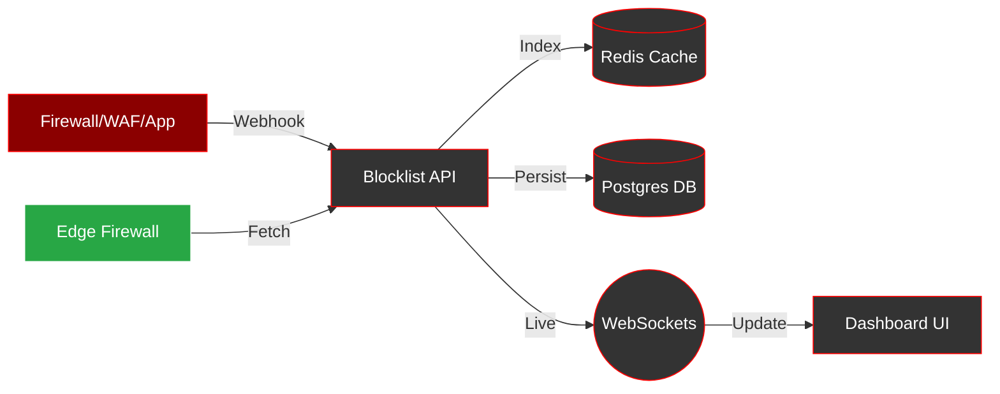

<p align="center">
  
</p>

<p align="center">
  <a href="#"></a>
  <a href="#"></a>
  <a href="#"></a>
  <a href="#"></a>
  <a href="#"></a>
</p>

# Blocklist App (Go Edition)

A high-performance, security-hardened IP management platform with GeoIP enrichment, real-time updates via WebSockets, and advanced filtering capabilities.

## 🔄 Project Flow



## Key Features

- **Advanced Filtering**: Server-side filtering by IP, Reason, Country, Added By, and Date Range (ISO8601).
- **Real-time Updates**: Live dashboard updates via WebSockets with PING/PONG keep-alive.
- **RBAC & Security**: Role-Based Access Control (Viewer, Operator, Admin) and API Token authentication.
- **GeoIP Enrichment**: Automated ASN, Country, and City detection for all entries.
- **Observability**: Prometheus metrics for latency and operations, protected by IP-based ACL.
- **Hardened Deployment**: Non-root Docker images based on Alpine 3.21 with conditional `:latest` tagging.

## Project Structure
- `cmd/server`: Go web server entry point, migrations, and static/template assets.
- `internal/api`: HTTP handlers, middlewares (Auth, RBAC, Metrics), and WebSocket hub.
- `internal/metrics`: Prometheus metrics definitions.
- `internal/repository`: Redis and PostgreSQL data access layers.
- `internal/service`: Core business logic (Auth, IP management, GeoIP, Webhooks).

## API Endpoints

### Automated Webhooks
- **`POST /webhook`**: Legacy endpoint for ban/unban actions.
    - **Example**: `curl -X POST -H "Content-Type: application/json" -d '{"ip":"1.2.3.4","act":"ban","reason":"manual","username":"admin","password":"password"}' http://localhost:5000/webhook`
- **`POST /api/v1/webhook`**: Authenticated webhook (HMAC supported).
    - **Example**: `curl -X POST -H "Authorization: Bearer YOUR_TOKEN" -H "Content-Type: application/json" -d '{"ip":"1.2.3.4","act":"ban","reason":"manual"}' http://localhost:5000/api/v1/webhook`
- **`POST /api/v1/webhook2_whitelist`**: Automatically whitelists the caller's IP.

### Data & Stats
- **`GET /api/v1/ips`**: Paginated list of blocked IPs with advanced filters.
- **`GET /api/v1/ips/export`**: Export data in CSV or NDJSON format.
- **`GET /api/v1/stats`**: Aggregate statistics including top countries, ASNs, and reasons.

## RBAC Roles

| Role | Permissions |
| :--- | :--- |
| **Viewer** | View dashboard, search IPs, view stats, export data. |
| **Operator** | All Viewer permissions + Block/Unblock IPs, manage Whitelist. |
| **Admin** | All Operator permissions + Manage Admin accounts and API tokens. |

## Quick Start (Development)

1. **Configure Environment**: Set required variables in `.env`.
2. **Start Dependencies**: Ensure Redis and PostgreSQL are running.
3. **Run Migrations**: Handled automatically on server start.
4. **Build & Run**:
   ```bash
   go build -o blocklist-server ./cmd/server/main.go
   ./blocklist-server
   ```

## Docker Deployment
- **Build**: `docker build -t blocklist:go .`
- **Run**: `docker compose -f docker-compose.go.yml up -d`

## Granular Permissions

The platform uses a detailed permission system for administrators:
- **Monitoring**: `view_ips`, `view_stats`, `view_audit_logs`
- **Enforcement**: `block_ips`, `unblock_ips`, `manage_whitelist`
- **System**: `manage_webhooks`, `manage_api_tokens`, `manage_admins`
- **Utility**: `export_data`

## Configuration
- `SECRET_KEY`: Session encryption secret (required).
- `GUIAdmin`/`GUIPassword`: Primary admin credentials.
- `RATE_LIMIT`: Global requests per period (default: 500).
- `RATE_PERIOD`: Rate limit window in seconds (default: 30).
- `RATE_LIMIT_LOGIN`: Login-specific limit (default: 10).
- `RATE_LIMIT_WEBHOOK`: Webhook-specific limit (default: 100).
- `METRICS_ALLOWED_IPS`: Comma-separated list of trusted IPs for `/metrics`.
- `ENABLE_OUTBOUND_WEBHOOKS`: Set to `true` to enable outbound notifications (default: `false`).
- `WEBHOOK_SECRET`: HMAC secret for signing outbound webhook payloads.

## Testing
Comprehensive unit, functional, and integration tests using `miniredis` and `testcontainers-go`.
```bash
# Run all tests
go test ./...

# Run unit/functional tests only (fast)
go test -short ./...
```

## GitHub Repository Settings
**About:**
Hardened Go-based IP Blocklist manager with GeoIP (ASN/Country), real-time WebSocket dashboard, RBAC, and automated webhooks.

**Topics:**
`golang` `security` `blocklist` `firewall-automation` `geoip` `prometheus` `websockets` `rbac` `docker-hardened`

## License
MIT