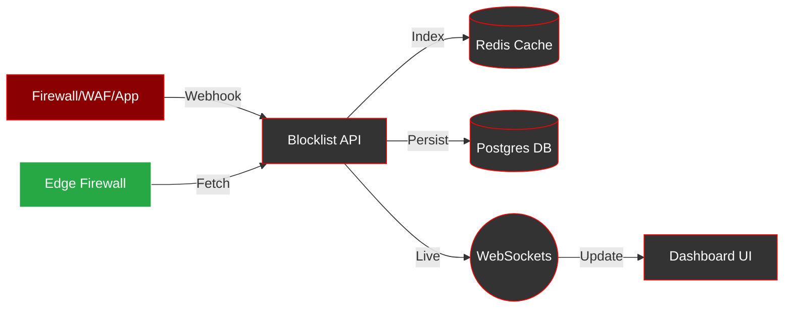

<p align="center">
  
</p>

<p align="center">
  <a href="#"></a>
  <a href="#"></a>
  <a href="#"></a>
  <a href="#"></a>
  <a href="#"></a>
  <a href="#"></a>
</p>

# Blocklist App (Go Edition)

A high-performance, security-hardened IP management platform with GeoIP enrichment, real-time updates via WebSockets, and advanced filtering capabilities.

## 🔄 Project Flow


```mermaid
graph LR
    Sources[Firewall/WAF/App] -->|Webhook| API[Blocklist API]
    API -->|Index| Redis[(Redis Cache)]
    API -->|Persist| PG[(Postgres DB)]
    API -->|Live| WS((WebSockets))
    WS -->|Update| UI[Dashboard UI]
    Firewall[Edge Firewall] -->|Fetch| API
    
    style Sources fill:#8b0000,stroke:#ff0000,color:#fff
    style API fill:#333,stroke:#ff0000,color:#fff
    style Redis fill:#333,stroke:#ff0000,color:#fff
    style PG fill:#333,stroke:#ff0000,color:#fff
    style WS fill:#333,stroke:#ff0000,color:#fff
    style UI fill:#333,stroke:#ff0000,color:#fff
    style Firewall fill:#28a745,stroke:#fff,color:#fff
```

## Key Features

- **Advanced Filtering**: Server-side filtering by IP, Reason, Country, Added By, and Date Range (ISO8601).
- **Real-time Updates**: Live dashboard updates via WebSockets, now scaled with **Redis Pub/Sub** for multi-instance support.
- **Visual Threat Intelligence**: Dedicated **Threat Map** page with interactive mapping (Leaflet) and distribution charts (Chart.js) for instant situational awareness.
- **Audit Trail & Optimization**: Complete history of IP actions with automated **per-IP entry limiting** (configurable) to prevent database bloat.
- **Ephemeral & Persistent Blocks**: Support for TTL-based temporary bans and manual persistent blocks.
- **Local Map Solution**: Integrated world GeoJSON for offline mapping without external tile provider dependencies.
- **Reliable Webhooks**: Persistent **Task Queue** for outbound notifications with automatic retries and exponential backoff.
- **Bulk Operations**: Multi-select interface for batch unblocking and management.
- **Security Hardening**: DOM-based XSS mitigation with robust HTML escaping, safe toast notifications using textContent, restricted slice memory allocation size validation, session invalidation on permission changes, and mandatory 2FA setup.
- **Continuous Analysis**: Integrated **CodeQL** and **Gosec** for automated vulnerability detection and static analysis.
- **Excluded List & Wildcard FQDNs**: Automated protection for critical targets. Supports background resolution, wildcard patterns, and **External Dynamic Sources** (e.g. M365, AWS) with auto-refresh.
- **Interactive API Docs**: Embedded **API Reference** via RapiDoc/Scalar at `/docs`.
- **GeoIP Enrichment**: Automated ASN, Country, and City detection for all entries.
- **Observability**: Prometheus metrics for latency and operations, protected by IP-based ACL.
- **Hardened Deployment**: Non-root Docker images based on Alpine 3.21 with conditional `:latest` tagging.

## 🛡️ Whitelist vs. Excluded List

While both lists prevent an IP from being listed in the active blocklist, they serve distinct architectural purposes:

### **Whitelist (Access Control)**
*   **Purpose**: To explicitly grant access to the application itself and other **internal/protected resources**.
*   **Scope**: Whitelisted IPs are considered "Trusted".
*   **Behavior**: Prevents an IP from being blocked **AND** provides an identity/access signal for integration with other systems.
*   **Usage**: Use this for your own office IPs, VPN gateways, or known safe customer IPs that need consistent access.

### **Excluded List (Target Protection)**
*   **Purpose**: To prevent **accidental blocking** of critical infrastructure or targets, regardless of their reputation.
*   **Scope**: Excluded entities are "untouchable".
*   **Behavior**: Only prevents the target from being blocked. It does **not** grant any special access or trust status.
*   **Advanced Features**:
    *   **External Dynamic Sources**: Subscribe to official IP/CIDR lists (e.g. [Microsoft 365](https://learn.microsoft.com/en-us/microsoft-365/enterprise/urls-and-ip-address-ranges), AWS, Cloudflare). Refreshes every 6 hours with failure fallback. Entries auto-expire after 24 hours if not refreshed.
    *   **Proactive Alerting**: Optionally trigger **Webhook** or **Mail** alerts whenever an excluded resource is attempted to be blocked.
    *   **FQDN Support**: Add `api.service.com` to prevent blocking any IP it currently resolves to.
    *   **Wildcard FQDNs**: Support for `*.google.com` using Forward-Confirmed Reverse DNS (FCrDNS).
*   **Usage**: Use this for critical third-party APIs (e.g., Stripe, AWS), search engine crawlers, or large CDN subnets where you want to ensure connectivity is never severed.

## Project Structure
- `cmd/server`: Go web server entry point, migrations, and static/template assets.
- `internal/api`: HTTP handlers, middlewares (Auth, RBAC, Metrics), and WebSocket hub.
- `internal/metrics`: Prometheus metrics definitions.
- `internal/repository`: Redis and PostgreSQL data access layers.
- `internal/service`: Core business logic (Auth, IP management, GeoIP, Webhooks, Dynamic Sources).

## API Endpoints

### Automated Webhooks
- **`POST /api/v1/webhook`**: Authenticated webhook. Supports `ban`, `unban`, `unban-ip`, `whitelist`, and `selfwhitelist` actions.
    - **Actions**:
        - `ban`: Blocks an IP. Use `persist: true` for permanent storage.
        - `unban` / `unban-ip`: Removes an IP from the blocklist.
        - `whitelist`: Adds an IP to the whitelist.
        - `selfwhitelist`: Whitelists the caller's source IP.
    - **Parameters**: `ip`, `act`, `reason`, `persist` (bool), `ttl` (int).
    - **Example (Block)**: `curl -X POST -H "Authorization: Bearer YOUR_TOKEN" -H "Content-Type: application/json" -d '{"ip":"1.2.3.4","act":"ban","reason":"manual","persist":false,"ttl":3600}' http://localhost:5000/api/v1/webhook`
    - **Example (Self-Whitelist)**: `curl -X POST -H "Authorization: Bearer YOUR_TOKEN" -H "Content-Type: application/json" -d '{"act":"selfwhitelist","reason":"homelab"}' http://localhost:5000/api/v1/webhook`
    - *Note: The `ip` parameter is required for all actions except `selfwhitelist`, where the system automatically detects your source IP via `X-Forwarded-For` or `CF-Connecting-IP`.*

### Data & Stats
*Note: Basic Authentication is supported as a fallback **ONLY** for whitelist endpoints. All other endpoints require a Bearer Token.*

- **`GET /api/v1/ips`**: Paginated list of blocked IPs with advanced filters.
- **`GET /api/v1/ips_list`**: Simple JSON array of all blocked IP addresses.
- **`GET /api/v1/raw`**: Plain-text list of blocked IPs.
- **`GET /api/v1/whitelists`**: Authenticated JSON list of all whitelisted IPs with metadata.
- **`GET /api/v1/whitelists-raw`**: Authenticated plain-text, newline-separated list of whitelisted IPs.
- **`GET /api/v1/ips/export`**: Export data in CSV or NDJSON format (Requires `export_data` permission and sudo).
- **`GET /api/v1/stats`**: Aggregate statistics including top countries, ASNs, and reasons.

## RBAC Roles

| Role | Permissions |
| :--- | :--- |
| **Viewer** | View dashboard, search IPs, view stats, export data. |
| **Operator** | All Viewer permissions + Block/Unblock IPs, manage Whitelist. |
| **Admin** | All Operator permissions + Manage Admin accounts and API tokens. |

## Quick Start (Development)

1. **Configure Environment**: Set required variables in `.env`.
2. **Start Dependencies**: Ensure Redis and PostgreSQL are running.
3. **Run Migrations**: Handled automatically on server start.
4. **Build & Run**:
   ```bash
   # Build Server
   go build -o blocklist-server ./cmd/server/main.go
   ./blocklist-server

   # Build Standalone Worker (Optional)
   go build -o blocklist-worker ./cmd/worker/main.go
   ./blocklist-worker
   ```

## Docker Deployment
- **Build**: `docker build -t blocklist:go .`
- **Run**: `docker compose -f docker-compose.go.yml up -d`

## Granular Permissions

The platform uses a detailed permission system for administrators:
- **Monitoring**: `view_ips`, `view_stats`, `view_audit_logs`
- **Enforcement**: `block_ips`, `unblock_ips`, `manage_whitelist`, `whitelist_ips`
- **System**: `manage_webhooks`, `manage_api_tokens`, `manage_admins`, `manage_excluded`
- **Utility**: `export_data`

## Configuration

The application is configured via environment variables:

| Variable | Description | Default |
|----------|-------------|---------|
| `SECRET_KEY` | Key for session signing and encryption | `change-me` |
| `PORT` | Listening port | `5000` |
| `REDIS_HOST` | Redis server hostname | `localhost` |
| `REDIS_PORT` | Redis server port | `6379` |
| `REDIS_PASSWORD` | Redis password | (empty) |
| `REDIS_DB` | Redis database for IP storage | `0` |
| `POSTGRES_URL` | PostgreSQL connection string | `postgres://...` |
| `GUIAdmin` | Primary administrator username | `admin` |
| `GUIPassword` | Primary administrator password | (empty) |
| `LOGWEB` | Enable verbose web logging (debug level) | `false` |
| `BLOCKED_RANGES` | Comma-separated list of subnets to whitelist | (empty) |
| `GEOIPUPDATE_LICENSE_KEY` | MaxMind License Key | (empty) |
| `ENABLE_OUTBOUND_WEBHOOKS` | Master switch for outbound notifications | `false` |
| `SMTP_HOST` | SMTP server for alerts | `""` |
| `SMTP_PORT` | SMTP port | `587` |
| `SMTP_USER` | SMTP username | `""` |
| `SMTP_PASS` | SMTP password | `""` |
| `SMTP_FROM` | Sender address for alerts | `""` |
| `SMTP_TO` | Recipient address for alerts | `""` |
| `AUDIT_LOG_LIMIT_PER_IP` | Max audit trail entries kept per IP | `100` |
| `LOG_RETENTION_MONTHS` | Number of months to retain logs | `6` |

## Testing
Comprehensive unit, functional, and integration tests using `miniredis` and `testcontainers-go`.
```bash
# Run all tests
go test ./...
```

## License
MIT
