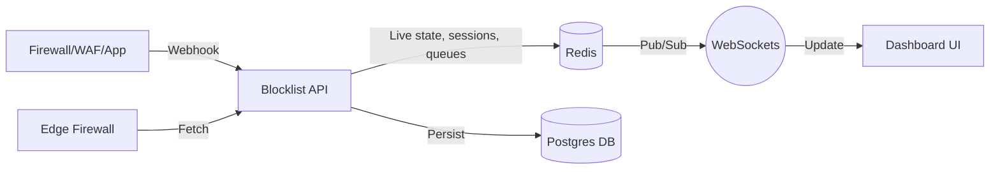

<p align="center">
  
</p>

<p align="center">
  <a href="go.mod"></a>
  <a href="docker-compose.go.yml"></a>
  <a href="Dockerfile"></a>
  <a href="https://github.com/arumes31/blocklist/actions"></a>
  <a href=".github/SECURITY_CHECKS.md"></a>
  <a href="LICENSE"></a>
</p>

# Blocklist App (Go Edition)

A self-hosted IP blocklist platform for firewall, WAF and application integrations.
Manage temporary or persistent blocks, whitelists and exclusions through a Go API
and a responsive web workspace, with GeoIP enrichment and live activity updates.

This README describes the current source tree. A running `latest` image only
contains changes that have been published and pulled; editing or merging source
does not by itself update an existing deployment.

| Guide | Contents |
| --- | --- |
| [Getting started](#getting-started) | Docker, local development and initial sign-in |
| [Workspace and redesign](#workspace-and-redesign) | Navigation, dashboard, map and account UI |
| [Microsoft Entra login](#microsoft-entra-login) | App roles, group assignment, provisioning and verification |
| [Entra setup guide](ENTRA_SETUP.md) | Full registration, secret mounting and troubleshooting instructions |
| [Configuration](#configuration) | Environment variables and log-retention limits |
| [Regression tests](TESTING.md) | Unit, integration, browser, accessibility and visual checks |
| [Release instructions](.github/RELEASING.md) | Protected production approval, image publication and rollback |
| [Security checks](.github/SECURITY_CHECKS.md) | CI scanners and repository protection setup |

## Architecture


```mermaid
graph LR
    Sources[Firewall/WAF/App] -->|Webhook| API[Blocklist API]
    API -->|Live state, sessions, queues| Redis[(Redis)]
    API -->|Persist| PG[(Postgres DB)]
    Redis -->|Pub/Sub| WS((WebSockets))
    WS -->|Update| UI[Dashboard UI]
    Firewall[Edge Firewall] -->|Fetch| API
```

PostgreSQL stores durable records, accounts, roles, tokens and logs. Redis supports
active state, sessions, rate limiting, task queues and cross-instance live updates.
The server embeds templates, JavaScript, styles and database migrations; Node.js
is a build/test dependency, not a production runtime dependency.

## Getting started

### Docker

Use Docker with Linux containers and Compose v2. The supplied
[Compose file](docker-compose.go.yml) builds the app and starts PostgreSQL and Redis
with persistent bind mounts.

1. Review its configuration before starting. It is an example with placeholder
   credentials, development database settings and port `5000` published on the
   host; it is not a production-ready secret configuration.
2. Set a strong, random `SECRET_KEY` of at least 32 characters, an initial
   `GUIPassword`, and unique PostgreSQL/Redis credentials. Keep credentials aligned
   between the app and its dependencies, including the Redis health check. Store
   real values in a private, ignored Compose override or your deployment's secret
   manager, never in tracked files. A `.env` file alone does not replace hardcoded
   Compose values: explicitly reference or pass each variable.
3. For GeoIP downloads, configure your MaxMind account/license and writable GeoIP
   data directory. Country/city/ASN information depends on the available databases.
4. Start the configured stack:

   ```sh
   docker compose -f docker-compose.go.yml up --build -d
   docker compose -f docker-compose.go.yml logs --tail=100 app
   ```

   If using a private override, add `-f <override-file>` after the base file in
   both commands. For local-only use, **replace**, rather than append to, the base
   `5000:5000` port mapping. With **Docker Compose v2.24.4 or later**, use this in
   that private override:

   ```yaml
   services:
     app:
       ports: !override
         - "127.0.0.1:5000:5000"
   ```

   An ordinary `ports` list can retain the base all-interface binding alongside
   the loopback entry. `!override` replaces the list completely; see
   [Docker's merge rules](https://docs.docker.com/reference/compose-file/merge/#replace-value).
   Before running `up`, inspect the resolved configuration with the same files:

   ```sh
   docker compose -f docker-compose.go.yml -f <override-file> config
   ```

   Confirm `services.app.ports` contains **only one binding**: `host_ip: 127.0.0.1`,
   published port `5000`, target port `5000`. There must be no additional wildcard,
   `0.0.0.0` or `::` binding. Upgrade older Compose versions before using this
   example. The resolved configuration may include credentials; do not share it.
5. Open `http://localhost:5000`, sign in with `GUIAdmin` (default `admin`) and the
   configured initial password, then enroll an authenticator. Database migrations
   run on server startup. Changing `GUIPassword` later does not reset an existing
   account's password.

For production, configure HTTPS, secure cookies and narrowly scoped trusted
proxies; protect and back up both data stores. Read the [upgrade notes](#upgrading)
before starting a new image against existing data. Do not reuse disposable test
credentials or remove production data directories to resolve a startup problem.

### Run from source

Use the Go version declared in [go.mod](go.mod), with PostgreSQL and Redis running.
Export the [configuration variables](#configuration) into the server process;
the Go binary does not automatically load `.env`.

```sh
go build -o blocklist-server ./cmd/server
./blocklist-server
```

On Windows, build `blocklist-server.exe` and run `./blocklist-server.exe`.
Background jobs run inside the server by default. To use the separate worker,
set `RUN_WORKER_IN_PROCESS=false` on the server and run `go run ./cmd/worker` with
the same storage and retention configuration. Do not disable the in-process
worker without replacing it if you need scheduled cleanup and queued delivery.
The standalone worker processes GeoIP jobs, but does not register the server's
periodic GeoIP download schedule; plan that separately for a split-worker deployment.

## Workspace and redesign

- **Shared design system:** charcoal surfaces, restrained accents, consistent
  rounded fields, clearer typography, responsive forms/tables, visible keyboard
  focus, hover states and permission-aware controls. Design rules are in
  [DESIGN.md](DESIGN.md).
- **Navigation:** the desktop icon rail expands on hover or keyboard focus and
  stays open when navigating between pages. Moving into page content restores
  auto-close behavior. Small screens use labeled navigation instead of a hover rail.
- **Sign-in:** the original animated logo and Aether particle background are
  restored. Choose Original Aether, Ember Tide, Vortex, Aurora, **Neural Mesh**
  (the default) or Sonar. The choice is saved in the browser. Play/Pause controls
  the login background and logo; RAW API and System health links remain available.
  Branding motion starts on each page load, including remote/reduced-motion
  sessions, and pauses while the page is hidden. The map has its own motion control.
- **Accounts:** Entra UPNs are shown instead of internal identity keys. Compact
  rows keep role selection, Apply and the local-override checkbox accessible;
  **Access details** reveals help and effective permissions. Identity bindings
  remain available separately, and status/actions wrap on smaller screens.
- **Separate log pages:** **Event logs** show IP enforcement activity;
  **System audit logs** show authentication, access and configuration changes.
  Each has its own navigation entry, permissions and retention window.
- **API reference:** embedded RapiDoc at `/docs`, with shared styling and stable
  scrolling. The OpenAPI document is available at `/openapi.json`.

### Dashboard and filtering

Search by IP or reason and combine country, Added By and date filters. Click a
**Top Countries**, **Top ASNs** or **Top Reasons** chip to filter the blocklist:
country uses the country selector; ASN uses `asn:<number>`; reason uses
`reason:<literal>` for an exact, case-insensitive reason match. Long labels wrap
instead of cutting off, and all ten ranking entries survive live refreshes.
Ranking counts describe the overall blocklist, not just the filtered result.

Saved views, CSV/NDJSON exports, column/density options and bulk actions remain
available according to permissions. Exports use the active filters and require
recent browser identity verification. Clear resets the filters; changing a
filter starts pagination again at the beginning.

The dashboard renders at most 100 rows per page, but filters cover the entire
blocklist. Selections persist across pages of the same search; select-all selects
the current page. Live events coalesce into server-filtered refreshes. Paused or
selected views show an updates-available control instead of accumulating rows.
Top rankings sit below the table and pagination.

### Threat map

The map uses the available display width and height, with responsive supporting
panels, a globe and an optional Leaflet flat map. Locally served world geometry
avoids dependence on an external tile provider.

- Globe zoom supports **0.8–128×**; the flat map supports zoom levels **1–18**.
  Use scrolling, zoom controls, dragging, regional views and Reset view.
- Selecting a grouped marker opens its members in **IP activity**, where each
  address can be inspected. Nearby coordinates separate as you zoom; addresses
  with identical GeoIP coordinates stay grouped. Locations are approximate—the
  map does not invent more precise positions for co-located addresses.
- **Include existing**, on by default, loads all current blocks from the complete
  `/api/v1/ips_list` snapshot, including older entries missing from the timestamp
  index. Switch it off for live-only activity.
- Live block markers last eight seconds, paths to reporting servers ten seconds.
  Paths require geolocation for both ends. Whitelisted addresses can stay visible
  (up to 500); live activity is bounded to 500 origins, 24 paths and 50 event entries.
  The 24-hour trend is a page-load snapshot.
- Activity/density and layer controls change presentation. Pausing motion does
  not pause incoming data or expiry. Dragging/zooming briefly holds rotation;
  selecting a region or IP keeps that view still. Reduced-motion preferences
  start the map still, with an explicit Enable motion option.

## Accounts, roles and API tokens

### Default roles and recovery administrator

| Role | Default access |
| --- | --- |
| Viewer | Read all workspace areas and metadata; export after verification. No changes. Passwords, MFA secrets and raw token values are never exposed. |
| Moderator | Viewer access plus unblock addresses, create whitelist entries and create exclusions. Cannot block addresses, delete whitelist/exclusion entries, or administer accounts, roles and integrations. |
| Editor | All current workspace, enforcement, configuration and access-management permissions. |
| Configured recovery administrator | The local account named by `GUIAdmin` has all current permissions independently of managed roles; it remains protected from role/status changes. |

In **Roles**, create custom roles and edit their individual capabilities. Built-in
roles can be edited but not deleted; remove assignments before deleting a custom
role. The table above describes the initial defaults, not immutable permissions.
The complete capability list is defined in
[the permission catalog](internal/models/identity.go).

Existing local accounts retain their legacy permissions until explicitly assigned
a managed role. Account managers cannot grant permissions they do not hold or
manage accounts with greater effective authority. Sensitive account/role changes
require a recently verified browser session; an API token cannot substitute for
that verification. Local users verify with their authenticator; Entra users
verify with Microsoft. Recovery-admin access still requires authentication.

### Account search and access status

In **Accounts**, search by account name or UPN and combine the **Sign-in source**
and **Status** filters. Filters remain selected after account changes or reloads.

Account managers can use **Disable** / **Enable** in the Status column after
identity verification. You cannot disable yourself, the configured recovery
administrator, or an account with permissions you do not hold.

- Disable rejects local/Entra sign-in, browser sessions, Basic authentication,
  and all API tokens owned by that account. Existing live connections close at
  their next authorization check, within 30 seconds; already-authorized requests
  may finish. Public endpoints remain public.
- Data, roles, passwords, MFA enrollment and tokens are retained. Enable allows
  sign-in again and restores otherwise-valid tokens; old browser sessions stay
  invalid. Disabling an integration account interrupts clients using its tokens.
- Entra auto-provisioning does not reactivate a disabled account. Status changes
  appear in **System audit logs**.

Migration `000018_account_status` is additive and defaults every existing account
to enabled. It runs on application startup when this version is deployed. An older
application version does not enforce disabled status; rolling back the migration
also removes that status. Treat either rollback as restoring account access.

### API-token compatibility

**My API Tokens** and **System API Tokens** refer to the same token mechanism;
the latter is an administrative view, not an unrestricted class of token.
Effective access is the intersection of a token's scopes and its owner's current
permissions. Expiry, revocation, source-IP/CIDR restrictions and disabled-owner
checks still apply. Recovery-admin tokens do not automatically gain every scope.

Upgrades preserve existing token hashes, scopes and restrictions, but reducing an
owner's permissions or disabling that owner can interrupt an integration. Review
the exact actions needed by Fail2ban, Fortigate, Graylog or other clients before
changing their accounts. Settings includes Fail2ban, Fortigate, Webhook and Auditor
scope templates; verify the selected scopes before issuing a token. Do not put
live tokens in documentation, screenshots or bug reports.

## Microsoft Entra login

Entra sign-in is optional and **disabled by default**. Local password/authenticator
login remains available for recovery. Use the [full Entra guide](ENTRA_SETUP.md)
for the detailed setup and tenant-specific verification checklist.

1. Register a **single-tenant** application with a **Web** redirect URI matching
   `https://blocklist.example.com/auth/entra/callback` exactly. Create a client
   secret and mount its **value** in a protected, read-only file readable by the
   container's non-root user; do not commit it.
2. Under **Token configuration → Add optional claim → ID**, add **`auth_time`**.
   Blocklist requires this proof for sensitive-operation verification, including
   when Microsoft authentication uses a passkey. A successful ordinary sign-in
   does not prove that fresh verification is configured.
   See [Microsoft's optional-claims instructions](https://learn.microsoft.com/en-us/entra/identity-platform/optional-claims).
3. Define app roles allowing users/groups, with these exact default values:

   | Entra app-role value | Blocklist role |
   | --- | --- |
   | `Blocklist.Viewer` | Viewer |
   | `Blocklist.Moderator` | Moderator |
   | `Blocklist.Editor` | Editor |

   Assign users or security groups to those roles under **Enterprise applications
   → Users and groups**, and enable **Assignment required**. Follow Microsoft's
   [app-role instructions](https://learn.microsoft.com/en-us/entra/identity-platform/howto-add-app-roles-in-apps)
   and the [group licensing/membership notes](ENTRA_SETUP.md#2-define-roles-and-assign-groups).
4. Pass these variables to the app, using your own registration and deployed URL:

   ```env
   ENTRA_ENABLED=true
   ENTRA_TENANT_ID=<directory-tenant-id>
   ENTRA_CLIENT_ID=<application-client-id>
   ENTRA_CLIENT_SECRET_FILE=/run/secrets/entra_client_secret
   ENTRA_REDIRECT_URL=https://blocklist.example.com/auth/entra/callback
   ENTRA_AUTO_PROVISION=true
   COOKIE_SECURE=true
   ```

   Mount the secret file at the configured path. Adding these lines to a Compose
   `.env` file is insufficient unless the service passes them into the container;
   the [guide's Compose example](ENTRA_SETUP.md#3-enable-login-and-just-in-time-provisioning) includes that wiring.
5. Test first sign-in, each role and **Verify identity** before relying on Entra
   for administration. Keep a working local recovery account.

**Group roles and provisioning:** Blocklist reads the ID token's `roles` claim,
not group names or IDs; no Microsoft Graph directory-read permission or group
claim is required. Multiple recognized roles resolve as Editor > Moderator >
Viewer; an unrecognized/missing role denies sign-in. With auto-provisioning enabled,
an eligible user is created on first successful sign-in. This is just-in-time
provisioning, **not SCIM or continuous directory synchronization**.

With `ENTRA_AUTO_PROVISION=false`, create an Entra account in **Accounts** using
the exact UPN and a role first. You do not enter tenant/object IDs per user:
first sign-in binds the account to the verified, stable tenant/object identity.
UPNs are display labels and can change; they do not replace internal account keys.
Entra's role is reapplied at sign-in unless **Keep local role override** is checked.

**Verification failures:** the Microsoft verification flow must return the same
identity and a fresh `auth_time`; a new token issue time alone is insufficient.
Missing/stale proof is rejected rather than bypassing the check. Follow
[verification troubleshooting](ENTRA_SETUP.md#troubleshooting-identity-verification)
for safe audit diagnostics and app registration checks.

Removing a user from an Entra group does not immediately invalidate existing
Blocklist sessions or tokens. For urgent removal, **Disable** the Blocklist account
as well as removing its Entra assignment. Auto-provisioning cannot re-enable it;
deleting only the local record can allow recreation at the next eligible sign-in.

## Blocks, whitelists and exclusions

- **Blocks:** temporary bans with TTL, persistent bans, individual/bulk unblocking
  and IP history, subject to retention limits.
- **Whitelist:** protect explicitly allowed addresses from blocking and publish
  a separate authenticated list for consuming integrations. Whitelisting does not
  bypass login, role checks or API-token authorization.
- **Excluded list:** protect IPs, CIDRs and domains from accidental blocking
  without granting additional application access. FQDNs use DNS resolution;
  wildcard domains use forward-confirmed reverse DNS.
- **External exclusion sources:** refresh IP/CIDR lists periodically (every six
  hours). Imported entries expire after 24 hours without refresh; a failed fetch
  does not immediately discard still-valid entries. Optional webhook/email alerts
  can notify operators of attempted blocks against excluded resources.
- **Outbound integrations:** persistent queued webhook delivery with retries and
  backoff. The `ENABLE_OUTBOUND_WEBHOOKS` master switch must be enabled as well as
  configuring the integration.

## API endpoints

Use `/docs` for the interactive reference and `/openapi.json` for the schema.
Protected endpoints accept an authorized browser session or appropriately scoped
Bearer token, except sensitive actions that explicitly require browser verification.
Basic authentication with local credentials is supported **only** for the two
whitelist read endpoints; it is not a general API or Entra-password fallback.

| Endpoint | Purpose / access |
| --- | --- |
| `GET /health` | Health check; no account authentication |
| `GET /api/v1/raw` | Public newline-separated blocked IPs; no account authentication |
| `GET /api/v1/ips` | Paginated, filtered block records; `view_ips` |
| `GET /api/v1/ips_list` | Complete JSON object keyed by IP, with entry metadata; `view_ips` |
| `GET /api/v1/ips/:ip/details` | IP details and retained activity; `view_ips` |
| `GET /api/v1/whitelists` | Whitelist JSON records; `view_ips` |
| `GET /api/v1/whitelists-raw` | Newline-separated whitelist; `view_ips` |
| `GET /api/v1/stats` | Aggregate statistics and top countries/ASNs/reasons; `view_stats` |
| `GET /api/v1/ips/export` | Filtered CSV or NDJSON; `export_data` plus recent browser verification |
| `POST /api/v1/webhook` | Inbound block/unblock/whitelist actions; action-specific permission |

`POST /api/v1/webhook` supports `ban`, `unban`, `unban-ip`, `whitelist` and
`selfwhitelist`. For example, send this JSON with a scoped Bearer token to create
a temporary block in a test deployment:

```json
{"ip":"203.0.113.42","act":"ban","reason":"manual test","persist":false,"ttl":3600}
```

Use `persist: true` for a persistent block. `selfwhitelist` uses the caller's
source IP instead of an `ip` field. Source-IP restrictions and forwarded addresses
depend on `TRUSTED_PROXIES` and, where applicable, `USE_CLOUDFLARE`; trust only the
actual proxies in front of the application, never arbitrary client-supplied headers.

## Configuration

The application reads environment variables at startup. Names are case-sensitive
in Linux containers: use **`GUIAdmin`** and **`GUIPassword`**, not uppercase aliases.
The following are application defaults; Compose/deployment settings can override
them. See [config.go](internal/config/config.go) for the complete list and
[Entra configuration](ENTRA_SETUP.md#configuration) for the identity-specific options.

| Variable | Description | Default |
|----------|-------------|---------|
| `SECRET_KEY` | Stable, high-entropy session key; use 32+ random characters. Changing it invalidates sessions. | Must be set; insecure default is rejected |
| `PORT` | Listening port | `5000` |
| `REDIS_HOST` | Redis server hostname | `localhost` |
| `REDIS_PORT` | Redis server port | `6379` |
| `REDIS_PASSWORD` | Redis password | (empty) |
| `REDIS_DB` | Redis database for IP storage | `0` |
| `REDIS_LIM_DB` | Redis database for rate limiting | `1` |
| `POSTGRES_URL` | Primary PostgreSQL connection string; explicitly configure credentials and transport security | Local development fallback; not production-ready |
| `POSTGRES_READ_URL` | Optional read connection; leave unchanged unless deliberately configuring a replica | Same as `POSTGRES_URL` |
| `GUIAdmin` | Configuration-managed local recovery administrator | `admin` |
| `GUIPassword` | Initial recovery password, required when seeding that account; not a password-reset setting | (empty) |
| `DISABLE_GUIADMIN_LOGIN` | Disable the configured recovery account's normal login; keep recovery available unless deliberately retiring it | `false` |
| `COOKIE_SECURE` | Send cookies only over HTTPS; enable for an HTTPS deployment | `false` |
| `COOKIE_SAMESITE_STRICT` | Stricter cookie policy; validate cross-site Entra callbacks before enabling | `false` |
| `FORCE_HTTPS` | HTTPS redirect setting; configure together with the reverse proxy | `false` |
| `TRUSTED_PROXIES` | Trusted proxy addresses/CIDRs, comma-separated | `127.0.0.1` |
| `USE_CLOUDFLARE` | Enable Cloudflare client-IP handling with a correctly restricted proxy path | `false` |
| `METRICS_ALLOWED_IPS` | Comma-separated exact source-IP allowlist for `/metrics`; CIDRs are not supported here | `127.0.0.1` |
| `RATE_LIMIT` / `RATE_PERIOD` | General request limit and period in seconds | `500` / `30` |
| `RATE_LIMIT_LOGIN` / `RATE_LIMIT_WEBHOOK` | Login/webhook limits for the configured period | `10` / `100` |
| `RUN_WORKER_IN_PROCESS` | Run maintenance and task workers in the server | `true` |
| `LOGWEB` | Enable verbose web logging (debug level) | `false` |
| `BLOCKED_RANGES` | Despite its name, these comma-separated CIDRs are protected from being blocked; this does not create whitelist records | (empty) |
| `GEOIPUPDATE_ACCOUNT_ID` / `GEOIPUPDATE_LICENSE_KEY` | MaxMind download credentials for City/ASN databases | (empty) |
| `ENABLE_OUTBOUND_WEBHOOKS` | Master switch for outbound notifications | `false` |
| `SMTP_HOST` | SMTP server for alerts | `""` |
| `SMTP_PORT` | SMTP port | `587` |
| `SMTP_USER` | SMTP username | `""` |
| `SMTP_PASS` | SMTP password | `""` |
| `SMTP_FROM` | Sender address for alerts | `""` |
| `SMTP_TO` | Recipient address for alerts | `""` |
| `AUDIT_LOG_LIMIT_PER_IP` | Maximum event entries per IP; does not prune system audit actions | `100` |
| `EVENT_LOG_RETENTION_MONTHS` | Event-log age limit, integer from `1` to `3` calendar months | `3` |
| `AUDIT_LOG_RETENTION_MONTHS` | System-audit-log age limit, integer from `1` to `12` calendar months | `12` |
| `LOG_RETENTION_MONTHS` | Legacy webhook-payload partition retention only; no longer expires audit/event partitions | `6` |

### Event and system-audit retention

Set these variables on **every server and standalone worker**, then recreate/restart
those processes with the new configuration:

```env
EVENT_LOG_RETENTION_MONTHS=3
AUDIT_LOG_RETENTION_MONTHS=12
```

These are environment-managed settings, not editable fields in the Settings page.
No additional database migration is required for this retention feature. Values
outside the ranges above, including `0`, negative numbers and non-integers, fail
startup validation; there is no unlimited-retention value.

Event logs cover block/unblock, whitelist and exclusion actions. System audit logs
cover sign-ins, accounts, roles and configuration; unknown or missing actions are
also treated as system history. Cutoffs use UTC calendar months, clamped at month
ends. The two log explorers apply their cutoff to both records and page counts
immediately, even while physical cleanup is still catching up.

**Expired history is permanently deleted after deployment. Back up/export anything
you need before starting the updated application.** The maintenance scheduler runs
on startup and every 15 minutes, coordinated across replicas through Redis. Each
category gets a separate 30-second budget and up to 100 batches of 1,000 rows, with
a 50 ms pause between full batches and a 5-second SQL timeout. A large backlog can
take several cycles; failures/timeouts are logged and retried next cycle. Regular
and DEFAULT partitions are included. Run either the in-process worker (the default)
or the standalone worker; disabling the former without running the latter leaves
physical cleanup inactive.

Retention never changes active blocks, whitelist/exclusion entries, accounts or
API tokens. It removes their old **history**, including old IP activity details.
The existing per-IP event cap may remove event history earlier. Increasing a
retention value later, or rolling back the image, cannot recover deleted records.
Backups and external log copies have their own retention policies.

This bounds retained history, not the number of entries: a busy three-month window
can still contain many pages. Exact counts and cleanup scans still depend on database
size and indexes. No index is silently created on a live multi-million-row table.
Repeated query-budget warnings can mean cleanup is making no progress; investigate
the query plan and review a suitable index/maintenance change before increasing load.
Monitor cleanup progress and autovacuum; ordinary deletion does not immediately
return the table's allocated disk space to the operating system.

## Testing

Use the Go version in `go.mod`, Node.js 24 and Docker with Linux containers/Compose v2:

```sh
go test -short ./...
npm ci --ignore-scripts
npm test
npm run test:ui
go test -race -tags=integration -count=1 -timeout=15m ./...
```

Race detection needs CGO and a C compiler, or a suitable Linux Go container.
Integration tests are explicitly tagged: an ordinary `go test ./...` does not
select them. See [TESTING.md](TESTING.md) for focused commands and prerequisites.

- **Go:** service/handler/repository tests, race checks, PostgreSQL/Redis integration
  tests, schema upgrades, role/status enforcement and legacy API-token compatibility.
- **JavaScript:** dashboard filters, pagination/rankings, map grouping, asset
  minification and release-workflow helpers.
- **Playwright:** real HTTP-backed account/role/token lifecycles, local password/TOTP
  login, navigation, dialogs, filters, map controls, errors and responsive layouts.
- **Accessibility and visuals:** axe checks, keyboard/focus/scrolling regressions
  and reviewed screenshot baselines at desktop and touch/mobile Chromium sizes.
  These are automated checks, not a claim of full WCAG or cross-browser conformance.

The browser runner builds the Docker image, starts a disposable PostgreSQL/Redis
stack with generated credentials and a loopback-only app port, and cleans up its
own resources. It does not load the developer's `.env` or target a running
deployment. Do not repoint destructive lifecycle tests at development, staging or
production. Reports/traces can contain test sessions and should be handled carefully.

Live Entra redirects, passkeys/Conditional Access, group assignments, external
integrations and actual GeoIP datasets still require deployment-specific checks.

## Performance and observability

Implemented optimizations reduce repeated work without introducing an
authentication cache or weakening enforcement:

- Dashboard statistics share a five-second snapshot per process; concurrent
  refreshes share the calculation. Search and enforcement do not use this cache.
- Raw-list generation and Bloom synchronization avoid retaining a second metadata
  map when only keys are needed. They still read the same Redis `HGETALL` snapshot
  and validate records; this lowers processing allocations, not Redis payload size.
- Concurrent DNS misses for the same name/address share one lookup. Positive,
  negative and timeout behavior remain intact; expiry sweeps run at most once
  a minute per cache during use, removing unused expired entries. This does not
  impose a cap on live cache entries.
- Bloom refresh no longer holds its lock during Redis I/O/decoding. During sync,
  negative checks fall back to Redis until the new snapshot is merged, preserving
  enforcement while avoiding a long shared-lock wait.
- Dashboard paging, coalesced refreshes and bounded map activity limit browser work.
- Docker builds minify external JavaScript with locked Terser dependencies before
  embedding assets into the Go binary. Tracked sources, script URLs and load order
  stay unchanged; inline template scripts are not minified. Node/npm are absent
  from the final non-root image. `npm run build:assets` previews generated files
  in ignored `.build/js/`.

[Performance tests and benchmark limits](TESTING.md#low-risk-performance-follow-up)
describe the measured work. Synthetic processing benchmarks are not production
latency guarantees and do not establish the cause of intermittent login/webhook
stalls. No SQL index, asynchronous audit write or token last-use tracking change
is implied by this optimization package.

Prometheus `/metrics` is restricted by `METRICS_ALLOWED_IPS`. Useful measurements
include `blocklist_http_duration_seconds`, `blocklist_redis_op_duration_seconds`,
block/unblock counters and received webhooks. Correlate these with PostgreSQL
query/lock/pool waits, Redis latency, disk I/O and memory pressure during an incident.

## Security and image releases

CI includes Go build/unit/integration race tests, frontend/browser checks,
golangci-lint, actionlint/ShellCheck, gosec, govulncheck, full-history Gitleaks,
CodeQL, dependency review and Trivy scans. Dependabot covers Go, npm, Docker and
GitHub Actions dependencies. See [security checks](.github/SECURITY_CHECKS.md) for
each workflow's triggers, reviewed exceptions and repository settings.

The **Docker Build and Check** workflow builds/checks branches, but **only `main`
can publish images**. On main, the pipeline publishes a uniquely tagged candidate,
scans its exact digest and runs runtime/browser checks against that image. A
reviewer must approve the protected **`production`** environment before the same
tested digest is promoted to `main`, `latest` and the full commit-SHA tag; no
rebuild occurs during promotion. Manual workflow dispatch on main uses these
same gates. Test/feature branches do not publish image tags.

The registry image is `ghcr.io/arumes31/blocklist`. Use a recorded image digest
when you need a reproducible deployment rather than relying only on `latest`.

Configure the GitHub environment with a required reviewer, administrator bypass
disabled, and deployment restricted to the exact `main` branch. The workflow
fails closed if required protection is missing or cannot be verified; YAML alone
does not create those repository settings. See the
[release setup and approval checklist](.github/RELEASING.md) and
[GitHub's environment documentation](https://docs.github.com/en/actions/how-tos/deploy/configure-and-manage-deployments/manage-environments).

Publication updates registry tags; the workflow does not connect to or restart
the production VM. An external auto-updater watching `latest` may still deploy
the new image. CI uses GitHub's workflow token, not production credentials.
Release instructions cover previous-image rollback tags, publication records and
conservative package cleanup. Binary releases through GoReleaser remain separate.

## Upgrading

1. Back up PostgreSQL and Redis and verify your restore procedure. Record the
   running image digest; a mutable `latest` tag is not an exact version identifier.
2. Review configuration and migrations against the installed version. Migration
   `000017_identity_roles` adds roles and stable Entra identity bindings while
   preserving legacy accounts and permission snapshots. Migration
   `000018_account_status` adds disabled status with every existing account enabled.
   The server applies pending migrations at startup.
3. Check [retention limits](#event-and-system-audit-retention) **before deployment**:
   defaults retain three months of event logs and twelve months of system audit
   logs, with permanent cleanup starting automatically. Export required history first.
4. Keep Entra disabled until its registration, secret and roles are configured.
   After enabling it, test both normal sign-in and sensitive-action verification;
   retain a tested local recovery path.
5. Check scoped integration tokens with their existing clients. Migrations preserve
   their stored data, but owner role reductions and account disabling intentionally
   restrict access. Run disposable upgrade tests separately, not against production.

An image rollback does not undo database migrations or restore deleted history.
Older application images may not enforce disabled accounts. Removing identity
migrations also removes Entra bindings; use a database backup and account-recovery
plan rather than treating a down migration as a routine rollback. See
[release/rollback instructions](.github/RELEASING.md).

## Project structure

- `cmd/server`: server entry point, embedded migrations, templates and static assets.
- `cmd/worker`: standalone background worker.
- `internal/api`: HTTP handlers, authentication/authorization, UI routes and WebSockets.
- `internal/config`, `internal/models`: configuration, permission catalog and data models.
- `internal/repository`: Redis/PostgreSQL access and migration compatibility tests.
- `internal/service`, `internal/tasks`: IP management, identity, DNS/GeoIP, maintenance and queued jobs.
- `internal/metrics`: Prometheus metrics.
- `scripts`, `tests`: asset/release helpers, JavaScript tests and isolated browser tests.
- `.github`: CI/security/release workflows and operating instructions.

## Contributing

Keep behavior changes covered by focused tests and run the relevant
[regression suites](TESTING.md). Keep shared UI changes consistent with
[DESIGN.md](DESIGN.md), review screenshot changes instead of blindly replacing
baselines, and update setup/upgrade documentation for configuration or migration
changes. Report security issues using [SECURITY.md](SECURITY.md), not public
reports containing credentials.

## License

[MIT](LICENSE).
