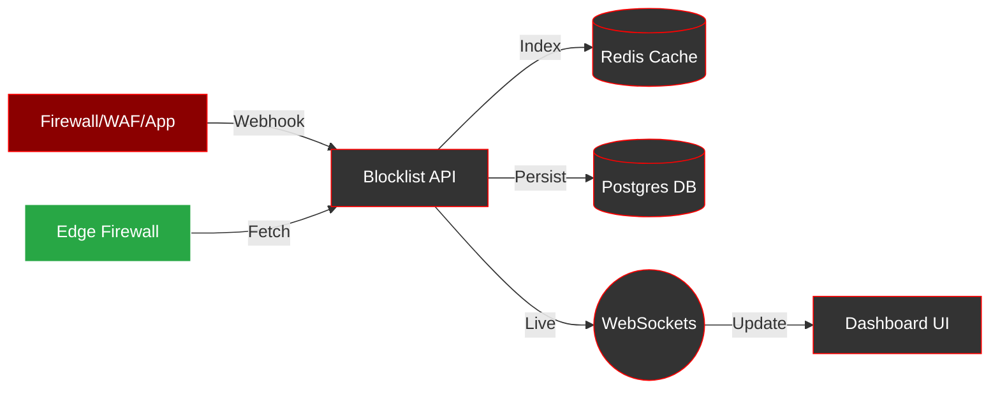

<p align="center">
  
</p>

<p align="center">
  <a href="#"></a>
  <a href="#"></a>
  <a href="#"></a>
  <a href="#"></a>
  <a href="#"></a>
  <a href="#"></a>
</p>

# Blocklist App (Go Edition)

A high-performance, security-hardened IP management platform with GeoIP enrichment, real-time updates via WebSockets, and advanced filtering capabilities.

## 🔄 Project Flow


```mermaid
graph LR
    Sources[Firewall/WAF/App] -->|Webhook| API[Blocklist API]
    API -->|Index| Redis[(Redis Cache)]
    API -->|Persist| PG[(Postgres DB)]
    API -->|Live| WS((WebSockets))
    WS -->|Update| UI[Dashboard UI]
    Firewall[Edge Firewall] -->|Fetch| API
    
    style Sources fill:#8b0000,stroke:#ff0000,color:#fff
    style API fill:#333,stroke:#ff0000,color:#fff
    style Redis fill:#333,stroke:#ff0000,color:#fff
    style PG fill:#333,stroke:#ff0000,color:#fff
    style WS fill:#333,stroke:#ff0000,color:#fff
    style UI fill:#333,stroke:#ff0000,color:#fff
    style Firewall fill:#28a745,stroke:#fff,color:#fff
```

## Key Features

For Microsoft sign-in, Entra group-to-role assignment, and automatic account provisioning, see the [Entra setup guide](ENTRA_SETUP.md).

### Account search and access status

In **Accounts**, search by account name or UPN and combine the **Sign-in source**
and **Status** filters. Filters remain selected after account changes or reloads.

Account managers can use **Disable** / **Enable** in the Status column after
identity verification. You cannot disable yourself, the configured recovery
administrator, or an account with permissions you do not hold.

- Disable rejects local/Entra sign-in, browser sessions, Basic authentication,
  and all API tokens owned by that account. Existing live connections close at
  their next authorization check, within 30 seconds; already-authorized requests
  may finish. Public endpoints remain public.
- Data, roles, passwords, MFA enrollment and tokens are retained. Enable allows
  sign-in again and restores otherwise-valid tokens; old browser sessions stay
  invalid. Disabling an integration account interrupts clients using its tokens.
- Entra auto-provisioning does not reactivate a disabled account. Status changes
  appear in **System audit logs**.

Migration `000018_account_status` is additive and defaults every existing account
to enabled. It runs on application startup when this version is deployed. An older
application version does not enforce disabled status; rolling back the migration
also removes that status. Treat either rollback as restoring account access.

For unit and real-browser regression checks, see [Testing](TESTING.md).

For approval-gated publication of the tested main image to `latest`, see
[Releasing images](.github/RELEASING.md). Configure the GitHub production
environment before merging; no production credentials are required by CI.

- **Advanced Filtering**: Server-side filtering by IP, Reason, Country, Added By, and Date Range (ISO8601).
  The dashboard renders at most 100 rows with Previous/Next navigation; searches and filters still cover the entire blocklist. Selections persist across pages of the same search, and select-all selects the current page. Live events coalesce into server-filtered refreshes; paused or selected views show an updates-available button instead of accumulating rows. Display statistics share a five-second snapshot per application process; search and enforcement never use that snapshot.
- **Real-time Updates**: Live dashboard updates via WebSockets, now scaled with **Redis Pub/Sub** for multi-instance support.
- **Visual Threat Intelligence**: The **Threat Map** shares the dashboard navigation and application red theme. **Include existing** is enabled by default and displays all current blocks from the complete `/api/v1/ips_list` snapshot, including older entries absent from the timestamp index. Disable it for live-only activity: block markers and activity entries appear for eight seconds; directional lines to the reporting server remain for ten seconds in either mode. Dense globe markers are grouped with accurate counts; the IP list retains every loaded record. Whitelisted IPs can stay visible (up to 500). Live activity is bounded to 500 origins, 24 paths, and 50 event entries. An optional Leaflet flat map preserves zoom, pan, clustering, and density. Lines require geolocation for both endpoints. The 24-hour trend is a page-load snapshot. Pausing motion leaves live data and expiry running.
  The globe zooms up to 12× for country detail and slowly rotates in the global view. Dragging and zooming hold rotation for eight seconds; selecting an IP or regional view keeps that location still. Reset view restores global rotation. Reduced-motion preferences start the map still, with an explicit Enable motion control to opt in.
- **Audit Trail & Optimization**: Complete history of IP actions with automated **per-IP entry limiting** (configurable) to prevent database bloat.
- **Ephemeral & Persistent Blocks**: Support for TTL-based temporary bans and manual persistent blocks.
- **Local Map Solution**: Integrated world GeoJSON for offline mapping without external tile provider dependencies.
- **Reliable Webhooks**: Persistent **Task Queue** for outbound notifications with automatic retries and exponential backoff.
- **Bulk Operations**: Multi-select interface for batch unblocking and management.
- **Security Hardening**: DOM-based XSS mitigation with robust HTML escaping, safe toast notifications using textContent, restricted slice memory allocation size validation, session invalidation on permission changes, and mandatory 2FA setup.
- **Continuous Analysis**: Integrated **CodeQL** and **Gosec** for automated vulnerability detection and static analysis.
- **Excluded List & Wildcard FQDNs**: Automated protection for critical targets. Supports background resolution, wildcard patterns, and **External Dynamic Sources** (e.g. M365, AWS) with auto-refresh.
- **Interactive API Docs**: Embedded **API Reference** via RapiDoc/Scalar at `/docs`.
- **GeoIP Enrichment**: Automated ASN, Country, and City detection for all entries.
- **Observability**: Prometheus metrics for latency and operations, protected by IP-based ACL.
- **Hardened Deployment**: Non-root Docker images based on Alpine 3.21 with conditional `:latest` tagging.

## 🛡️ Whitelist vs. Excluded List

While both lists prevent an IP from being listed in the active blocklist, they serve distinct architectural purposes:

### **Whitelist (Access Control)**
*   **Purpose**: To explicitly grant access to the application itself and other **internal/protected resources**.
*   **Scope**: Whitelisted IPs are considered "Trusted".
*   **Behavior**: Prevents an IP from being blocked **AND** provides an identity/access signal for integration with other systems.
*   **Usage**: Use this for your own office IPs, VPN gateways, or known safe customer IPs that need consistent access.

### **Excluded List (Target Protection)**
*   **Purpose**: To prevent **accidental blocking** of critical infrastructure or targets, regardless of their reputation.
*   **Scope**: Excluded entities are "untouchable".
*   **Behavior**: Only prevents the target from being blocked. It does **not** grant any special access or trust status.
*   **Advanced Features**:
    *   **External Dynamic Sources**: Subscribe to official IP/CIDR lists (e.g. [Microsoft 365](https://learn.microsoft.com/en-us/microsoft-365/enterprise/urls-and-ip-address-ranges), AWS, Cloudflare). Refreshes every 6 hours with failure fallback. Entries auto-expire after 24 hours if not refreshed.
    *   **Proactive Alerting**: Optionally trigger **Webhook** or **Mail** alerts whenever an excluded resource is attempted to be blocked.
    *   **FQDN Support**: Add `api.service.com` to prevent blocking any IP it currently resolves to.
    *   **Wildcard FQDNs**: Support for `*.google.com` using Forward-Confirmed Reverse DNS (FCrDNS).
*   **Usage**: Use this for critical third-party APIs (e.g., Stripe, AWS), search engine crawlers, or large CDN subnets where you want to ensure connectivity is never severed.

## Project Structure
- `cmd/server`: Go web server entry point, migrations, and static/template assets.
- `internal/api`: HTTP handlers, middlewares (Auth, RBAC, Metrics), and WebSocket hub.
- `internal/metrics`: Prometheus metrics definitions.
- `internal/repository`: Redis and PostgreSQL data access layers.
- `internal/service`: Core business logic (Auth, IP management, GeoIP, Webhooks, Dynamic Sources).

## API Endpoints

### Automated Webhooks
- **`POST /api/v1/webhook`**: Authenticated webhook. Supports `ban`, `unban`, `unban-ip`, `whitelist`, and `selfwhitelist` actions.
    - **Actions**:
        - `ban`: Blocks an IP. Use `persist: true` for permanent storage.
        - `unban` / `unban-ip`: Removes an IP from the blocklist.
        - `whitelist`: Adds an IP to the whitelist.
        - `selfwhitelist`: Whitelists the caller's source IP.
    - **Parameters**: `ip`, `act`, `reason`, `persist` (bool), `ttl` (int).
    - **Example (Block)**: `curl -X POST -H "Authorization: Bearer YOUR_TOKEN" -H "Content-Type: application/json" -d '{"ip":"1.2.3.4","act":"ban","reason":"manual","persist":false,"ttl":3600}' http://localhost:5000/api/v1/webhook`
    - **Example (Self-Whitelist)**: `curl -X POST -H "Authorization: Bearer YOUR_TOKEN" -H "Content-Type: application/json" -d '{"act":"selfwhitelist","reason":"homelab"}' http://localhost:5000/api/v1/webhook`
    - *Note: The `ip` parameter is required for all actions except `selfwhitelist`, where the system automatically detects your source IP via `X-Forwarded-For` or `CF-Connecting-IP`.*

### Data & Stats
*Note: Basic Authentication is supported as a fallback **ONLY** for whitelist endpoints. All other endpoints require a Bearer Token.*

- **`GET /api/v1/ips`**: Paginated list of blocked IPs with advanced filters.
- **`GET /api/v1/ips_list`**: Simple JSON array of all blocked IP addresses.
- **`GET /api/v1/raw`**: Plain-text list of blocked IPs.
- **`GET /api/v1/whitelists`**: Authenticated JSON list of all whitelisted IPs with metadata.
- **`GET /api/v1/whitelists-raw`**: Authenticated plain-text, newline-separated list of whitelisted IPs.
- **`GET /api/v1/ips/export`**: Export data in CSV or NDJSON format (Requires `export_data` permission and sudo).
- **`GET /api/v1/stats`**: Aggregate statistics including top countries, ASNs, and reasons.

## RBAC Roles

| Role | Permissions |
| :--- | :--- |
| **Viewer** | View dashboard, search IPs, view stats, export data. |
| **Operator** | All Viewer permissions + Block/Unblock IPs, manage Whitelist. |
| **Admin** | All Operator permissions + Manage Admin accounts and API tokens. |

## Quick Start (Development)

1. **Configure Environment**: Set required variables in `.env`.
2. **Start Dependencies**: Ensure Redis and PostgreSQL are running.
3. **Run Migrations**: Handled automatically on server start.
4. **Build & Run**:
   ```bash
   # Build Server
   go build -o blocklist-server ./cmd/server/main.go
   ./blocklist-server

   # Build Standalone Worker (Optional)
   go build -o blocklist-worker ./cmd/worker/main.go
   ./blocklist-worker
   ```

## Docker Deployment
- **Build**: `docker build -t blocklist:go .`
- **Run**: `docker compose -f docker-compose.go.yml up -d`

## Granular Permissions

The platform uses a detailed permission system for administrators:
- **Monitoring**: `view_ips`, `view_stats`, `view_audit_logs`
- **Enforcement**: `block_ips`, `unblock_ips`, `manage_whitelist`, `whitelist_ips`
- **System**: `manage_webhooks`, `manage_api_tokens`, `manage_admins`, `manage_excluded`
- **Utility**: `export_data`

## Configuration

The application is configured via environment variables:

| Variable | Description | Default |
|----------|-------------|---------|
| `SECRET_KEY` | Key for session signing and encryption | `change-me` |
| `PORT` | Listening port | `5000` |
| `REDIS_HOST` | Redis server hostname | `localhost` |
| `REDIS_PORT` | Redis server port | `6379` |
| `REDIS_PASSWORD` | Redis password | (empty) |
| `REDIS_DB` | Redis database for IP storage | `0` |
| `POSTGRES_URL` | PostgreSQL connection string | `postgres://...` |
| `GUIAdmin` | Primary administrator username | `admin` |
| `GUIPassword` | Primary administrator password | (empty) |
| `LOGWEB` | Enable verbose web logging (debug level) | `false` |
| `BLOCKED_RANGES` | Comma-separated list of subnets to whitelist | (empty) |
| `GEOIPUPDATE_LICENSE_KEY` | MaxMind License Key | (empty) |
| `ENABLE_OUTBOUND_WEBHOOKS` | Master switch for outbound notifications | `false` |
| `SMTP_HOST` | SMTP server for alerts | `""` |
| `SMTP_PORT` | SMTP port | `587` |
| `SMTP_USER` | SMTP username | `""` |
| `SMTP_PASS` | SMTP password | `""` |
| `SMTP_FROM` | Sender address for alerts | `""` |
| `SMTP_TO` | Recipient address for alerts | `""` |
| `AUDIT_LOG_LIMIT_PER_IP` | Maximum event entries per IP; does not prune system audit actions | `100` |
| `EVENT_LOG_RETENTION_MONTHS` | Event-log age limit, integer from `1` to `3` calendar months | `3` |
| `AUDIT_LOG_RETENTION_MONTHS` | System-audit-log age limit, integer from `1` to `12` calendar months | `12` |
| `LOG_RETENTION_MONTHS` | Legacy webhook-payload partition retention only; no longer expires audit/event partitions | `6` |

### Event and system-audit retention

Set these variables on **every server and standalone worker**, then recreate/restart
those processes with the new configuration:

```env
EVENT_LOG_RETENTION_MONTHS=3
AUDIT_LOG_RETENTION_MONTHS=12
```

These are environment-managed settings, not editable fields in the Settings page.
No additional database migration is required for this retention feature. Values
outside the ranges above, including `0`, negative numbers and non-integers, fail
startup validation; there is no unlimited-retention value.

Event logs cover block/unblock, whitelist and exclusion actions. System audit logs
cover sign-ins, accounts, roles and configuration; unknown or missing actions are
also treated as system history. Cutoffs use UTC calendar months, clamped at month
ends. The two log explorers apply their cutoff to both records and page counts
immediately, even while physical cleanup is still catching up.

**Expired history is permanently deleted after deployment. Back up/export anything
you need before starting the updated application.** The maintenance scheduler runs
on startup and every 15 minutes, coordinated across replicas through Redis. Each
category gets a separate 30-second budget and up to 100 batches of 1,000 rows, with
a 50 ms pause between full batches and a 5-second SQL timeout. A large backlog can
take several cycles; failures/timeouts are logged and retried next cycle. Regular
and DEFAULT partitions are included. Run either the in-process worker (the default)
or the standalone worker; disabling the former without running the latter leaves
physical cleanup inactive.

Retention never changes active blocks, whitelist/exclusion entries, accounts or
API tokens. It removes their old **history**, including old IP activity details.
The existing per-IP event cap may remove event history earlier. Increasing a
retention value later, or rolling back the image, cannot recover deleted records.
Backups and external log copies have their own retention policies.

This bounds retained history, not the number of entries: a busy three-month window
can still contain many pages. Exact counts and cleanup scans still depend on database
size and indexes. No index is silently created on a live multi-million-row table.
Repeated query-budget warnings can mean cleanup is making no progress; investigate
the query plan and review a suitable index/maintenance change before increasing load.
Monitor cleanup progress and autovacuum; ordinary deletion does not immediately
return the table's allocated disk space to the operating system.

## Testing
Comprehensive unit, functional, and integration tests using `miniredis` and `testcontainers-go`.
```bash
# Run all tests
go test ./...

# Dashboard cursor state tests (Node.js, no npm dependencies)
node --test tests/dashboard_pager.test.cjs
```

## License
MIT
